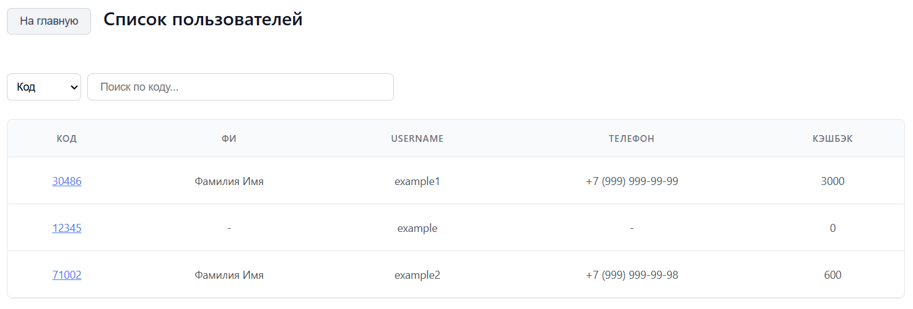

# Бот системы лояльности магазина техники
#### Система лояльности розничного магазина техники на основе Телеграм бота с интеграцией 1С.
___
## Стек технологий
- Java + SpringBoot + Liquibase + Hibernate;
- TypeScript + React + Next.js;
- PostgreSQL;
- 1С.
___
## Функционал бота

#### Для клиентов магазина:
- проверка наличия подписки на указанный канал при старте бота;

- отображение наличия смартфонов данными, полученными из БД 1С, по кнопке "Узнать наличие";

- получения сгенерированного сервером пятизначного кода для накопления/списания бонусных баллов.

#### Для администратора бота дополнительно:
- получение актуальной ссылки системы лояльности (веб-приложения);

- получение/изменение аутентификационных данных системы лояльности.

#### Менеджеру приходит уведомление, если кто-то интересовался наличием смартфонов

___
## Функционал веб-приложения
- авторизация менеджера;

- поиск клиента по коду;

- отображение список пользователей, зарегистрированных в системе лояльности;

- начисление/списание бонусных баллов и ввод данных клиента;

- если клиент ранее не был внесён в БД 1С, то добавление его данных в качестве контрагента.
